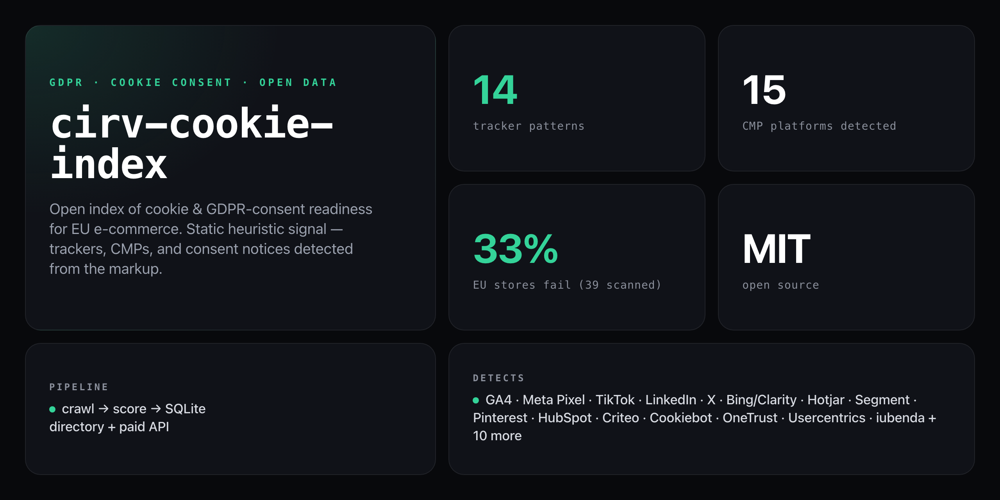

<div align="center">

**Static heuristic signal for GDPR / ePrivacy readiness — trackers, CMPs, and cookie notices detected from the markup.**


</div>

---

**33% of EU e-commerce stores hard-code trackers with no consent platform** — graded F in the first 39-store crawl. cirv-cookie-index is an open dataset and API that scores GDPR / ePrivacy cookie-consent readiness from static HTML. It detects third-party trackers, consent-management platforms (CMPs), and cookie notices — and flags the red-flag pattern: trackers present with no detectable CMP.

```
cirv-cookie-index · scanning 39 EU stores
━━━━━━━━━━━━━━━━━━━━━━━━━━━━━━━━━━━━━━━━━━

 score  domain                 fails
  100   otto.de                0 fails
  100   bol.com                0 fails
   67   aboutyou.com           1 fails
   33   example-store.eu       2 fails    ← trackers with no CMP
    0   noncompliant.eu        3 fails    ← F grade

ok 39 · skipped 0 · error 0
```

## Install

No npm account needed — clone and run directly:

```bash
git clone https://github.com/NickCirv/cirv-cookie-index.git
cd cirv-cookie-index
npm install
```

## Usage

### Crawl a seed list

```bash
# Crawl the included EU e-commerce seed list
node bin/crawl.js seeds/eaa-ecommerce.json

# Custom seed file, custom DB path, 8 parallel workers
node bin/crawl.js seeds/my-stores.json --db data/my.db --concurrency 8

# Skip robots.txt enforcement
node bin/crawl.js seeds/my-stores.json --no-robots
```

| Flag | Description |
|------|-------------|
| `<seeds.json\|.txt>` | Seed file — JSON array of domains or `.txt` one per line |
| `--db <path>` | SQLite database path (default: `data/index.db`) |
| `--concurrency <N>` | Parallel crawl workers (default: `4`) |
| `--no-robots` | Disable robots.txt enforcement |

### Report on the dataset

```bash
# Text leaderboard (best score first)
node bin/report.js

# JSON output
node bin/report.js --json

# Different DB
node bin/report.js --db data/my.db
```

### Run the API server

```bash
node api/server.js
# Listening on :4000
```

Set `STRIPE_SECRET_KEY` to enable paid-tier billing endpoints. Without it, `/v1/billing/*` returns `503` and the free-tier API still works.

## API endpoints

| Endpoint | Auth | Description |
|----------|------|-------------|
| `POST /v1/signup` | none | Issue a free API key (100 req/day) |
| `GET /v1/sites` | Bearer key | Paginated index (`?limit=50&offset=0`) |
| `GET /v1/sites/:domain` | Bearer key | Full findings for one domain |
| `GET /v1/usage` | Bearer key | Current tier + rate-limit status |
| `POST /v1/billing/checkout` | none | Start Stripe checkout (paid tiers) |
| `GET /healthz` | none | Health check |

**Tiers:** Free (100 req/day) · Starter (5 000/day) · Pro (50 000/day) · Bulk (500 000/day)

## What it detects

### Trackers (14 patterns)

| Tracker | Signal |
|---------|--------|
| Google Analytics / GTM | `googletagmanager.com`, `gtag(` |
| Google Ads / DoubleClick | `doubleclick.net`, `googlesyndication.com` |
| Meta Pixel | `connect.facebook.net`, `fbevents.js` |
| TikTok Pixel | `analytics.tiktok.com`, `ttq.load` |
| LinkedIn Insight | `snap.licdn.com`, `_linkedin_partner_id` |
| X / Twitter Pixel | `static.ads-twitter.com`, `twq(` |
| Microsoft Bing / Clarity | `bat.bing.com`, `clarity.ms` |
| Hotjar | `static.hotjar.com`, `hjid` |
| Segment | `cdn.segment.com` |
| Pinterest Tag | `pintrk(`, `s.pinimg.com/ct` |
| Amplitude | `cdn.amplitude.com` |
| Mixpanel | `cdn.mxpnl.com` |
| HubSpot | `js.hs-scripts.com` |
| Criteo | `static.criteo.net` |

### Consent-Management Platforms (15 detected)

Cookiebot · OneTrust · Usercentrics · CookieYes · iubenda · Didomi · Termly · Klaro · Osano · Complianz · Cookie Script · Quantcast · Borlabs · consentmanager · TrustArc

## Scoring

Each domain is scored across three checks:

| Check | Pass condition |
|-------|---------------|
| Consent platform | No trackers, OR trackers + a detectable CMP |
| Cookie notice | No trackers, OR trackers + a visible notice in the markup |
| Tracker gating | No trackers, OR trackers with a CMP present |

Score = `passes / 3 × 100`. Grade A = 100, F = 0 (trackers, no CMP, no notice).

## What it is NOT

- **Not a runtime compliance auditor.** Static HTML cannot prove trackers fire *before* consent — JS-injected trackers are invisible here. A score of 100 means "no hardcoded red flags," not "GDPR compliant." All downstream copy must say this.
- **Not a legal opinion.** This is a technical signal for prioritisation. Consult a DPO for actual compliance advice.
- **Not a replacement for headless verification.** The upgrade path (v2) is a hybrid spot-check that verifies pre-consent firing — deferred until traction justifies the infra cost.

## Architecture

```
seeds/*.json
    ↓
bin/crawl.js  →  engine/fetch.js (SSRF-safe HTTP)
                 engine/cookies.js (heuristic scorer)
    ↓
src/store.js  →  SQLite (data/index.db)
    ↓
bin/report.js       (CLI leaderboard)
bin/build-site.js   (static directory)
api/server.js       (Express REST API + Stripe billing)
```

The cookie engine (`engine/cookies.js`) is purpose-built for this index. The crawler, store, site-builder, and API are shared with the Cirv accessibility index — only the rule engine differs.

---

<div align="center">
<sub>Node 22 · SQLite · MIT · by <a href="https://github.com/NickCirv">NickCirv</a></sub>
</div>
