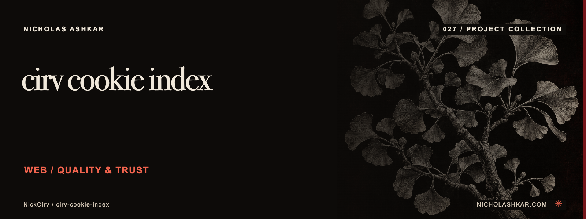

# cirv-cookie-index

Collects static cookie and consent-related signals from storefront homepages and publishes a Cirvgreen index.


<a id="usage"></a>

<a id="crawl-a-seed-list"></a>

<a id="crawl-the-included-eu-e-commerce-seed-list"></a>

<a id="custom-seed-file-custom-db-path-8-parallel-workers"></a>

<a id="skip-robotstxt-enforcement"></a>

<a id="report-on-the-dataset"></a>

<a id="text-leaderboard-best-score-first"></a>

<a id="json-output"></a>

<a id="different-db"></a>

<a id="run-the-api-server"></a>

<a id="listening-on-4000"></a>

<a id="api-endpoints"></a>

<a id="what-it-detects"></a>

<a id="trackers-14-patterns"></a>

<a id="consent-management-platforms-15-detected"></a>

<a id="scoring"></a>

<a id="architecture"></a>

## What it does

- Cookie/consent pattern detection.
- Seeded crawler and SQLite store.
- Directory generation.
- Authenticated read API and usage limits.


<a id="install"></a>

## Quickstart

Prerequisites: Node.js `22.x` and npm. The checkout below pins the source used for this documentation.

```sh
git clone https://github.com/NickCirv/cirv-cookie-index.git
cd cirv-cookie-index
git checkout e23adb20591a4caeb014f10411d769d0c842c0f9
npm install
npm run report
```

**Expected behavior (illustrative, not captured):** Reads existing scan records from the local SQLite store and summarizes them.

Examples are source-inspected, **not runtime-tested**. See the research record for verification gaps.


<a id="what-it-is-not"></a>

## Boundaries and data

HTML signatures cannot prove valid consent, detect every runtime cookie or establish GDPR compliance. Results are conservative screening signals. Crawling and optional Firecrawl/Stripe integrations make external requests.

## Development

The manifest defines `npm test` as:

```sh
node engine/test.js && node test.js && node api/test.js
```

The captured tests cover selected implementation paths; their presence does not establish a passing run. Tests were not run for this documentation revision.

See [implementation and command reference](docs/REFERENCE.md) for the package scripts and inspected interfaces, and [research record](docs/RESEARCH.md) for the pinned source, document decisions and unresolved checks.

This is a Cirvgreen product surface; its product-specific brand authority is preserved.

## License and contact

See [LICENSE](LICENSE) for the original terms and attribution. Legal text is unchanged.

[Nicholas Ashkar](https://nicholashkar.com/) · [Discuss a project](https://nicholashkar.com/#oxblood-contact)
